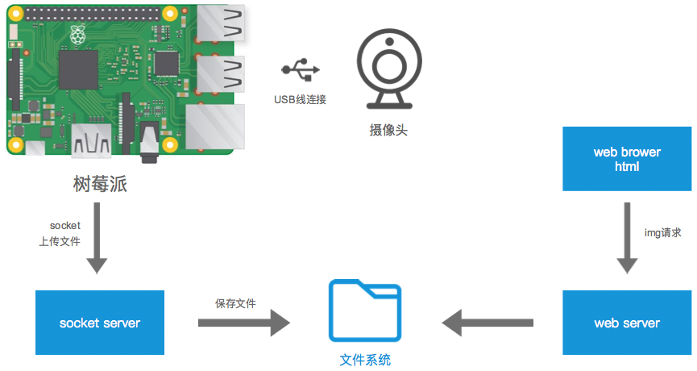

# Picamera

基于树莓派和普通 Web 摄像头的 Python 图传监控系统，支持 OpenCV 运动检测和人脸识别。

## 系统架构



系统由三个部分组成：

| 组件 | 文件 | 运行位置 | 说明 |
|------|------|----------|------|
| Socket 客户端 | `socket_client.py` | 树莓派 | 通过 USB 摄像头采集图像，经 Socket 发送至服务器 |
| TCP 服务器 | `server.py` | Linux 服务器 | 接收图像数据，经 OpenCV 检测后保存到磁盘并缓存至内存 |
| HTTP 服务器 | `server.py`（内嵌） | Linux 服务器 | 提供标注图片、原始图片和检测结果 JSON 三个端点 |
| 检测模块 | `detector.py` | Linux 服务器 | OpenCV 运动检测、人脸检测，可扩展物体识别和目标跟踪 |

## 检测功能

| 功能 | 方法 | 状态 |
|------|------|------|
| 运动检测 | 帧差法 (`cv2.absdiff`) + 轮廓检测 | 已实现 |
| 人脸检测 | Haar 级联分类器 (`haarcascade_frontalface_default.xml`) | 已实现 |
| 物体识别 | MobileNet-SSD（预留接口） | 待实现 |
| 目标跟踪 | KCF/CSRT tracker（预留接口） | 待实现 |

服务器采用**双通道**架构：同时保存原始图片和标注后图片，并生成结构化 JSON 检测结果。OpenCV 未安装时自动降级为无检测模式，服务器仍可正常运行。

## HTTP 端点

| 路径 | Content-Type | 说明 |
|------|-------------|------|
| `GET /latest.jpg` | `image/jpeg` | 标注后的图片（含检测框和标签） |
| `GET /raw.jpg` | `image/jpeg` | 原始未标注图片 |
| `GET /detection.json` | `application/json` | 检测结果（计数、各检测框坐标、置信度、处理耗时） |

## 通信协议

客户端与服务器之间使用自定义二进制协议，通过 TCP 端口 **10086** 通信。

### 图片上传协议

```
┌──────────────────── 头部（struct 'IdI'）────────────────────┐
│  设备 ID (4B, int)  │  时间戳 (8B, double)  │  文件大小 (4B, uint)  │
└─────────────────────────────────────────────────────────────┘
│                        JPEG 数据流                           │
│                 （每次发送 1024 字节分块）                      │
└─────────────────────────────────────────────────────────────┘
```

- 服务器收到后保存至 `upload/d_{设备ID}.jpg`，随即进行 OpenCV 检测处理
- 服务器通过时间戳判断是否为最新图片，拒绝过时数据
- 每设备有独立写锁（`threading.Lock`），防止并发写入冲突

## 快速开始

### 环境要求

- Python 3.6+
- OpenCV（可选，未安装时检测功能自动禁用）

```bash
pip install opencv-python
```

### 启动服务器

```bash
# 默认监听 0.0.0.0:10086
python server.py

# 自定义地址和端口
python server.py --host 192.168.1.100 --port 8080
```

### 发送测试图片

```bash
# 发送指定图片
python socket_client.py upload/bbb.jpg

# 自定义服务器地址、端口和设备 ID
python socket_client.py photo.jpg --host 192.168.1.100 --port 8080 --device-id 2
```

### 浏览器查看

打开 `test_html.html` 查看检测监控面板（含标注图片、检测统计、检测详情，每 2 秒自动刷新），或直接访问：

```
http://127.0.0.1:10086/latest.jpg      # 标注图片
http://127.0.0.1:10086/raw.jpg         # 原始图片
http://127.0.0.1:10086/detection.json  # 检测结果
```

### 命令行帮助

```bash
python server.py --help
python socket_client.py --help
```

## 项目结构

```
Picamera/
├── server.py           # TCP/HTTP 服务器（接收图片 + 检测 + 多端点服务）
├── detector.py         # OpenCV 检测模块（运动检测、人脸检测）
├── socket_client.py    # Socket 客户端
├── test_html.html      # 浏览器检测监控面板
├── upload/             # 接收到的图片存储目录
└── file/
    └── picamera01.png  # 系统架构图
```

## 联系方式

- 文档：https://loadstarcn.github.io/Picamera/
- 邮箱：richard@olive-app.com
